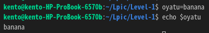
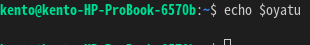

# 調べもの

## シェル変数
シェル変数とはシェルが持っている変数。
シェルスクリプト内の変数もシェル変数。(シェルスクリプト実行後に破棄される。)
シェル変数は環境変数と違って、異なるシェル間では基本的に共有されない。(exportをつけて変数定義すると環境変数として定義できる。)
例えば、シェルスクリプト1からシェルスクリプト2を呼び出す場合、それぞれのスクリプトは異なるシェル上で実行される。
つまり、シェルスクリプト1で定義した変数はシェルスクリプト2で使用することはできない。

シェル1

シェル2

シェル変数は異なるシェルに引き継がれない。
シェル変数はsetコマンドで全て表示できる(環境変数も表示される)。

## パーティション
1つのHDDを分割して複数の領域に分けること。\
WindowsではCドライブとかDドライブとかで表示されているあれ。\
メリットは影響範囲を絞れることらしい。例えば、CドライブでOS関連ファイル